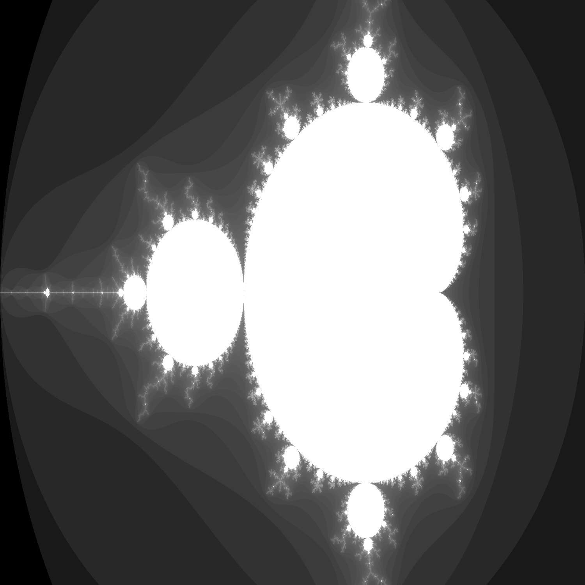
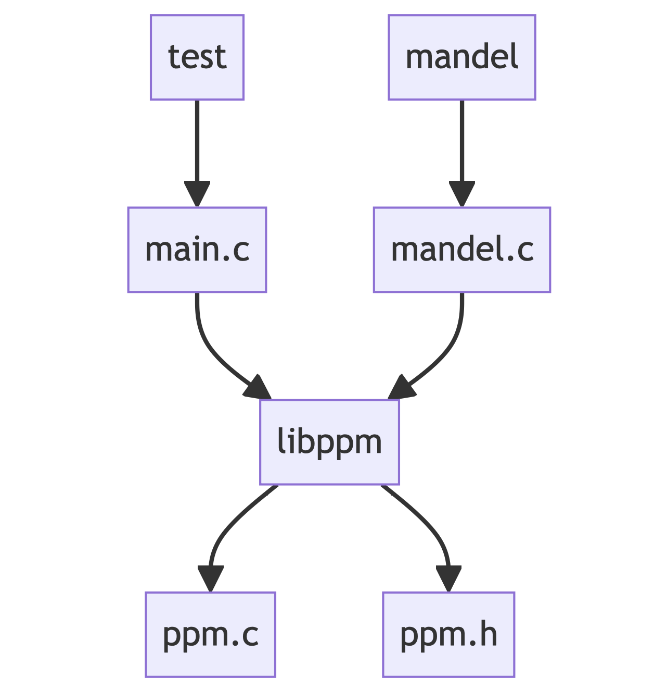

# Mandelbrot
Generate a mandelbrot figure in PPM image format

## Usage
1. Compile: `make`
2. Execute: 
   
   `./mandel`  OR  `./mandel <threshold>`
   
   You can specify the threshold or use the default value which is 2

## Dependancy graph

## 2. The Mandelbrot figure
The Mandelbrot set is a collection of points in the complex plane. Each point represents an initial complex number `c`. We apply an iterative process to each point using the formula `z_{n+1} = z_{n}^2 + c`, where `z_{n}` starts at zero. We repeat this process, checking whether the sequence `z_{n}` remains bounded or escapes to infinity. If the sequence remains bounded, the point belongs to the Mandelbrot set; otherwise, it does not. The Mandelbrot set is the collection of all initial points `c` for which the sequence `z_{n}` remains bounded. It exhibits intricate self-similar and infinitely complex fractal patterns.

## 3. Merge color_support
1. To bring back color_support on master we need to merge color_support and main in main branch.
2. 3 conflicting files 
   - Makefile -> Due to comments added -> keep main
   - mandel.c -> Added color specific code (struct, function and main code) -> Fusion
   - ppm.h -> Due to docstring -> keep main

## 4. How this repo is made
1. This repo use GIT and is hosted on GitHub
2. This repo is a fork of https://github.com/besnardjb/ATOI_24_TP_GIT.git

