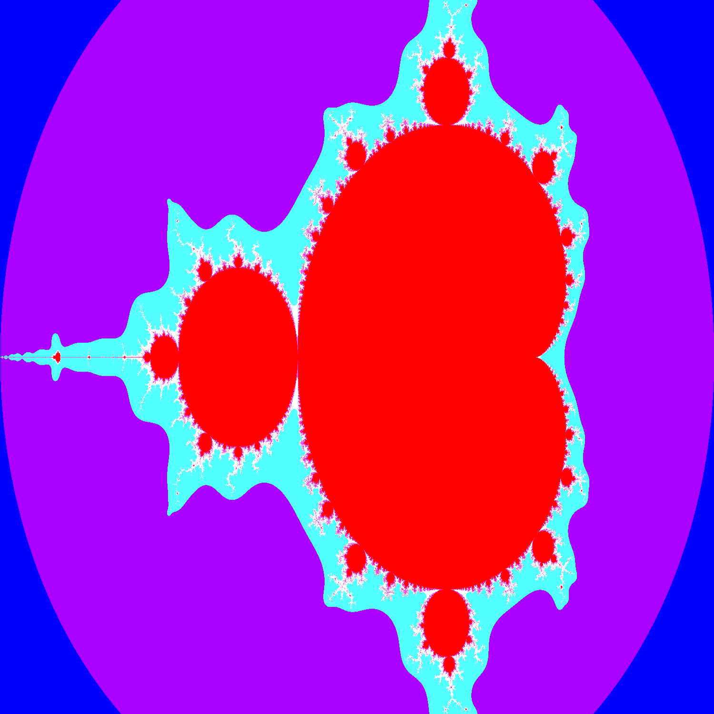

# Mandelbrot
Generate a mandelbrot figure in PPM image format

## Dependancy graph

## The Mandelbrot figure
The Mandelbrot set is a collection of points in the complex plane. Each point represents an initial complex number `c`. We apply an iterative process to each point using the formula `z_{n+1} = z_{n}^2 + c`, where `z_{n}` starts at zero. We repeat this process, checking whether the sequence `z_{n}` remains bounded or escapes to infinity. If the sequence remains bounded, the point belongs to the Mandelbrot set; otherwise, it does not. The Mandelbrot set is the collection of all initial points `c` for which the sequence `z_{n}` remains bounded. It exhibits intricate self-similar and infinitely complex fractal patterns.
